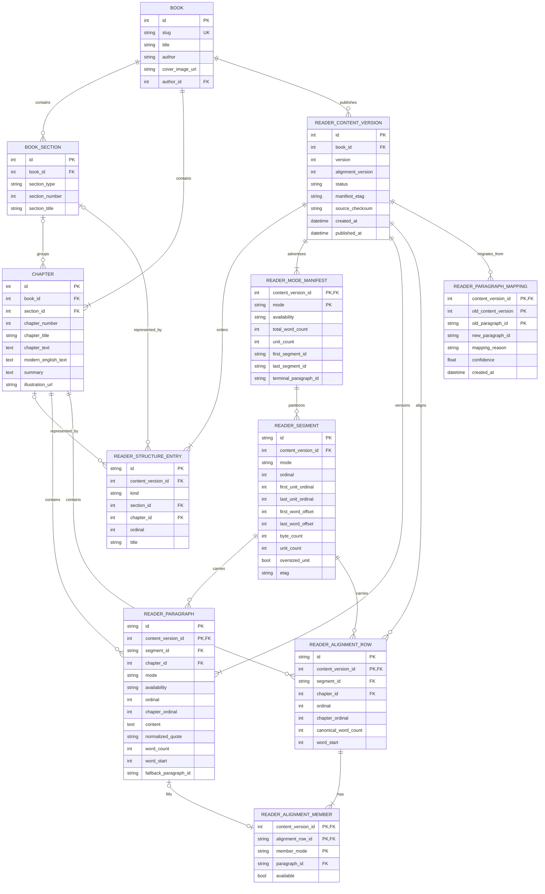
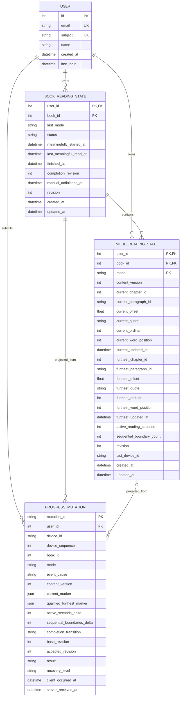
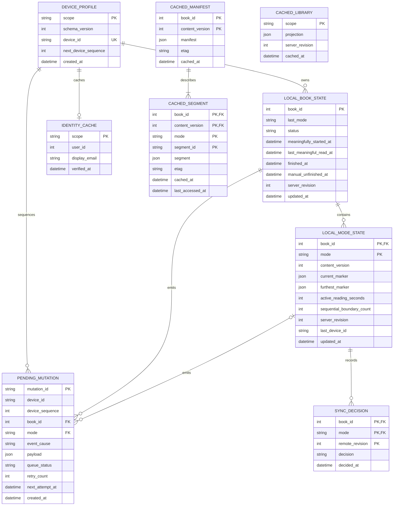

# Summra Library and Continuous Reader ERD

**Status:** Implemented design
**Product requirements:** [`CONTINUOUS_READER_LIBRARY_PRD.md`](CONTINUOUS_READER_LIBRARY_PRD.md)
**Scope:** Reader content metadata, cloud reading state, browser persistence, and API projections

## 1. Design decisions

- Replace the existing progress schema in place. `data/summra.db` contains test data only, so there is no legacy progress migration, dual-write period, or compatibility projection.
- Do not add rollout feature flags. The v2 model replaces the current reader-progress implementation atomically and Git remains the code rollback mechanism.
- Store immutable reader-content metadata in `data/database.db` alongside the existing books and chapters. The server lazily compiles a new immutable version if source text changes; deployment also compiles the catalog in advance.
- Store authenticated user state and accepted mutation history in `data/summra.db`.
- Store anonymous progress, pending mutations, and offline reader data in IndexedDB.
- Keep content and user databases physically separate. References from user progress to books, chapters, content versions, and paragraph IDs are validated by application code because SQLite cannot enforce foreign keys across database files.
- Side-by-Side is a first-class reading mode. It uses persisted alignment rows, not parallel-array indexes. An alignment row may contain Original, Plain English, or both, and has one logical position and one progress weight.
- Rendered page indexes and pixel positions are presentation state only and never appear in durable storage.

## 2. Identifier and naming rules

| Identifier | Format | Stability rule |
| --- | --- | --- |
| `book_id`, `chapter_id`, `section_id` | Existing SQLite integer ID | Must survive content updates. Replace `INSERT OR REPLACE` writes with conflict updates that preserve row IDs. |
| `content_version_id` | SQLite integer ID | Immutable after publication. A book may have many versions but only one published version. |
| `paragraph_id` | Random opaque text ID | Retained while an unambiguous normalized paragraph survives; scoped by `content_version_id` in physical keys. |
| `alignment_row_id` | Random opaque text ID | Assigned once per compiled logical Original/Plain English pair; scoped by `content_version_id` in physical keys. |
| `segment_id` | Opaque text ID | Stable inside one content version and mode. A new content version may use different segments. |
| `device_id` | Random opaque text ID | One per browser profile; never derived from browser characteristics. |
| `mutation_id` | UUID/ULID text | Globally unique and used as the idempotency key. |
| `revision` | Monotonic integer | Server-authoritative optimistic-concurrency value. |

Reader modes use canonical storage values `summary`, `original`, `plain`, and `side_by_side`. The existing frontend value `modern` is removed from persisted and API data.

## 3. Content database

The catalog is compiled and validated before deployment. The application also detects a changed source checksum and creates a new immutable reader version lazily, so a newly edited book remains readable without a separate backfill job.



### 3.1 `reader_content_version`

Constraints and indexes:

- Unique `(book_id, version)`.
- At most one `status = 'published'` row per book, enforced by a partial unique index.
- `status` is one of `draft`, `published`, or `retired`.
- Published rows and their child records are immutable. A content edit creates a new version.
- `manifest_etag` covers the complete metadata-only manifest; `source_checksum` covers the chapter source fields from which it was compiled.

### 3.2 `reader_structure_entry`

- Represents ordered part and chapter headings in the manifest.
- `kind` is `part` or `chapter`.
- Exactly one of `section_id` or `chapter_id` is populated according to `kind`.
- Headings carry zero progress weight.
- The compiler places headings into segment responses according to their logical insertion ordinal; segment boundaries never split a heading.

### 3.3 `reader_mode_manifest`

- Contains exactly four rows per content version, one for each canonical mode.
- `availability` is `available`, `partial`, or `unavailable`.
- An unavailable mode has no segments and null first, last, and terminal IDs.
- `total_word_count` is the denominator used for mode progress. For Side-by-Side it is the sum of alignment-row `canonical_word_count`, not both columns.
- `terminal_paragraph_id` references a paragraph for the first three modes and an alignment row for Side-by-Side.
- These materialized values let the metadata-only manifest be served without aggregating prose tables at request time.

### 3.4 `reader_paragraph`

- Stores logical units for `summary`, `original`, and `plain` modes.
- Primary key `(content_version_id, id)`; unique `(content_version_id, mode, ordinal)` and `(content_version_id, mode, chapter_id, chapter_ordinal)`.
- `availability` is `available` or `gap`.
- An available row has nonempty `content`; a gap has `content = NULL` and may reference an Original `fallback_paragraph_id`.
- Plain English gaps are explicit logical units. The client displays “Plain English unavailable for this section” and may offer the referenced Original paragraph.
- `word_start` is the cumulative mode word offset before this paragraph. Percentage is computed from `word_start`, `word_count`, and marker offset.
- `normalized_quote` is length-limited public-domain text used only for recovery.

### 3.5 `reader_alignment_row` and `reader_alignment_member`

- Primary key `(content_version_id, id)`. One row is one Side-by-Side logical position and the durable Side-by-Side marker target.
- Each row has exactly one Original membership and one Plain English membership record.
- A membership may have `paragraph_id = NULL` only when `available = false`.
- Each available Original or Plain English paragraph belongs to no more than one alignment row in a content version.
- Alignment is explicit. Later rows never shift because an earlier member is absent.
- `canonical_word_count` uses the Original paragraph word count when Original exists; otherwise it uses the Plain English word count. Both columns are never summed.
- `word_start` is cumulative over alignment rows and is the Side-by-Side progress denominator.
- Side-by-Side offset is a 0..1 fraction through the logical row. When the visible fragment comes from either member, its member-relative fraction maps proportionally to the row offset. Responsive layout changes therefore retain the same row and approximate semantic position.
- A Side-by-Side segment references alignment rows. It does not duplicate the member text.

### 3.6 `reader_segment`

- Unique `(content_version_id, mode, ordinal)`.
- `mode` includes all four modes. `side_by_side` segments contain alignment rows; the other modes contain paragraphs.
- Generation targets 24 KiB of uncompressed text.
- `byte_count <= 65536` and `unit_count <= 80`, except one explicitly flagged oversized paragraph.
- Previous and next segment IDs are derived from `ordinal`, avoiding mutable linked-list columns.
- Segment boundaries do not split paragraphs, alignment rows, or headings and do not dictate visual page boundaries.

### 3.7 `reader_paragraph_mapping`

- Records explicit mappings from an older published content version into the new version.
- The old paragraph need not remain in the current paragraph table, so `old_paragraph_id` is intentionally not a foreign key.
- Side-by-Side recovery derives a new alignment row through an explicitly mapped member paragraph, then falls back to the nearest row in the same chapter when no member mapping is available.

## 4. Cloud reading-state database

`data/summra.db` is recreated with this schema. There are no `reading_progress` or `chapter_completion` tables.



### 4.1 `book_reading_state`

- Primary key `(user_id, book_id)`.
- `book_id` is a logical reference to the content database and is validated on every API request.
- `last_mode` is one of the four canonical modes.
- `status` is `preview`, `in_progress`, or `finished`.
- Continue Reading requires `status = 'in_progress'` and `meaningfully_started_at IS NOT NULL`.
- Finished ordering uses `finished_at DESC`; Continue Reading ordering uses `last_meaningful_read_at DESC`.
- Marking unfinished clears `finished_at`, records `manual_unfinished_at`, and preserves all mode markers.
- `completion_revision` prevents an older ordinary reading mutation from overriding completion or a later manual-unfinish transition.

Required index:

```sql
CREATE INDEX idx_book_reading_library
ON book_reading_state(user_id, status, last_meaningful_read_at DESC);
```

### 4.2 `mode_reading_state`

- Primary key `(user_id, book_id, mode)`.
- Current and furthest markers are stored independently for all four modes.
- For `summary`, `original`, and `plain`, `*_paragraph_id` references a content `reader_paragraph.id` logically.
- For `side_by_side`, `*_paragraph_id` contains a `reader_alignment_row.id`. The column keeps the PRD marker name while its target is the pair’s logical paragraph identity.
- `*_ordinal` and `*_word_position` are server-derived cached ordering values. Clients cannot submit authoritative percentages or ordering.
- Current markers may move in either direction.
- Furthest markers only advance after a qualified sequential event, except explicit content-version remapping.
- `offset` is constrained to `0.0 <= offset <= 1.0`.
- Meaningful-engagement counters are accumulated idempotently from accepted mutations.

### 4.3 `progress_mutation`

- `mutation_id` is the API idempotency key.
- Unique `(user_id, device_id, device_sequence)` prevents sequence reuse by one device.
- `event_cause` is one of `page_turn`, `mode_exit`, `toc`, `hidden`, `pagehide`, `navigation`, `completion`, or `manual_unfinish`.
- `result` is `accepted`, `duplicate`, `conflict`, or `rejected`.
- `current_marker` and `qualified_furthest_marker` retain the submitted candidates for diagnostics and conflict recovery.
- A conflicting current candidate remains in this table while the canonical candidate remains in `mode_reading_state`; neither is silently discarded.
- `qualified_furthest_marker` is nullable and ignored for jump/programmatic causes.
- `completion_transition` is nullable or `finished`/`unfinished`.
- Mutation processing, state projection, and revision assignment occur in one database transaction.

## 5. Browser IndexedDB

IndexedDB is authoritative for immediate device resume and the durable outbound queue. Cloud synchronization is asynchronous and never blocks reading.



### 5.1 Object stores and keys

| Store | IndexedDB key | Purpose |
| --- | --- | --- |
| `device_profile` | `scope` | Singleton device record containing schema version, random `device_id`, and next monotonic `device_sequence`. Sequence allocation occurs in the same transaction as mutation insertion. |
| `identity_cache` | `scope` | Cached authenticated identity for offline display. Sign-out deletes this store’s active record without deleting reading state. |
| `local_book_state` | `book_id` | Anonymous or signed-in book status and Library ordering fields. |
| `local_mode_state` | `[book_id, mode]` | Per-mode current/furthest markers and engagement counters. |
| `pending_mutation` | `mutation_id` | Durable local-first mutation queue. Indexed by `[queue_status, next_attempt_at]` and `[device_id, device_sequence]`. |
| `cached_library` | `scope` | Last usable Library projection. `scope` distinguishes anonymous/device and authenticated-user projections. |
| `cached_manifest` | `[book_id, content_version]` | Versioned metadata-only manifests. |
| `cached_segment` | `[book_id, content_version, mode, segment_id]` | Versioned bounded reader content coordinated with service-worker caching. |
| `sync_decision` | `[book_id, mode, remote_revision]` | Reserved for a future remote-position prompt; no automatic reader movement is performed. |

### 5.2 Transaction boundaries

- A reader save updates `local_book_state`/`local_mode_state`, allocates the next device sequence, and inserts `pending_mutation` in one IndexedDB transaction.
- Lifecycle events write the same mutation to IndexedDB before attempting ordinary queued synchronization; a browser termination may defer the network request but cannot lose the local mutation.
- An acknowledgement updates the local server revision and removes only the acknowledged `mutation_id` in one transaction.
- Failed and conflicting mutations remain durable.
- Signing in changes synchronization scope but does not rewrite mutation IDs or device sequences.
- Signing out deletes cached identity only. Anonymous/device reading state remains available.

## 6. Durable marker value

The same marker value is embedded in `mode_reading_state`, IndexedDB mode state, and mutation payloads:

```json
{
  "book_id": 123,
  "mode": "side_by_side",
  "content_version": 7,
  "chapter_id": 456,
  "paragraph_id": "alignment_01J...",
  "offset": 0.42,
  "quote": "short normalized recovery excerpt",
  "updated_at": "2026-09-07T20:15:00Z"
}
```

Marker rules:

- `paragraph_id` is a paragraph ID for Summary, Original, or Plain English and an alignment-row ID for Side-by-Side.
- `offset` is a clamped logical fraction, never a line, page, or pixel offset.
- `quote` is public-domain recovery text, normalized and length-limited.
- The server validates book, mode, content version, chapter, logical unit, and offset before accepting the mutation.
- Cached ordinals and percentages are resolved by the server and are not part of the authoritative client marker.

## 7. Side-by-Side data behavior

| Case | Alignment representation | Reader behavior |
| --- | --- | --- |
| Both sides available | One row with Original and Plain memberships | Two columns at or above 760 px; stacked Original then Plain English below 760 px. |
| Original only | Original membership plus unavailable Plain membership | Preserve row; show explicit Plain English unavailable state. |
| Plain only | Unavailable Original membership plus Plain membership | Preserve row; show explicit Original unavailable state. |
| Neither side | Invalid alignment row | Content compiler rejects publication. |
| First entry from Original/Plain | Resolve that paragraph’s alignment membership | Open the corresponding alignment row without advancing furthest progress. |
| Return to Side-by-Side | Resolve saved alignment-row marker | Ignore the other full-text modes’ current markers. |
| Responsive layout change | Re-paginate around alignment-row ID and proportional offset | Do not replace the marker with a visual page index. |
| Progress calculation | Use `canonical_word_count` once | Never add Original and Plain word counts together. |

## 8. API projections

| Endpoint | Reads | Writes | Notes |
| --- | --- | --- | --- |
| `GET /api/reader/books/{book_id}/manifest` | Book, published content version, structure entries, segments | None | Metadata only; no prose or full-book description. |
| `GET /api/reader/books/{book_id}/segments/{segment_id}?mode={mode}` | Segment plus paragraphs or alignment rows/members | None | Immutable by book, mode, version, and segment ID. |
| `POST /api/reader/books/{book_id}/map` | Published alignment metadata | None | Maps a current marker into a requested reader mode. |
| `POST /api/reader/books/{book_id}/recover` | Current and historical reader versions plus mappings | None | Recovers an old-content marker without overwriting stored state. |
| `GET /api/progress/v2/books/{book_id}` | Book state and all four mode states | None | Returns canonical revisions and server timestamps. |
| `POST /api/progress/v2/mutations` | Content validation metadata and current projections | Mutation log and state projections | Idempotent and transactional. |
| `GET /api/library` | Book states, last-mode state, content book metadata | None | Returns Continue Reading and Finished cards without N+1 requests. |

`GET /api/library` joins data from the two SQLite databases in application code. It first fetches the user’s ordered state rows from `summra.db`, then performs one batched content query for all referenced books and chapters from `database.db`.

## 9. Projection and merge invariants

- Local state is written before a network mutation is attempted.
- A duplicate `mutation_id` produces the original acknowledgement and never reapplies deltas.
- Active seconds and sequential-boundary increments are applied once per accepted mutation.
- Current marker accepts backward movement and TOC navigation.
- Furthest marker is the maximum qualified word position within the resolved content version.
- Content-version changes resolve through paragraph identity, explicit mappings, quote, ordinal, chapter opening, then book opening.
- Completion is book-level. It does not require every mode to reach its end.
- A finished transition wins over older ordinary progress; a later manual-unfinish transition wins over that completion.
- Manual unfinish preserves all current and furthest mode markers.
- A remote marker never moves an active reader automatically.
- The Library displays server-derived furthest percentage, capped at 99% until book status is `finished`.

## 10. Initialization and removal of the old progress model

Because existing progress data is disposable test data, implementation should:

1. Stop the application before replacing the database file.
2. Remove or archive the existing `data/summra.db`.
3. Initialize the new user and reading-state schema from `UserDatabase.init_db()`.
4. Remove `reading_progress` and `chapter_completion` model methods and v1 routes.
5. Replace frontend `localStorage` progress keys with the IndexedDB stores above.
6. Change every progress caller before restarting the application; there is no mixed-schema operating period.

This reset applies only to `data/summra.db`. It must never delete or replace `data/database.db`, which contains the book corpus and compiled reader content.

## 11. Required validation coverage

- Stable chapter IDs survive content updates.
- Paragraph and alignment IDs survive an idempotent compiler rerun.
- Every published book has exactly one published content version.
- Every advertised mode has a valid ordered segment sequence.
- Every Side-by-Side row has exactly two membership records and at least one available member.
- Every available alignment member points to the correct book, version, chapter, and mode.
- No later Side-by-Side row shifts when an earlier member is missing.
- Segment payload limits and oversized-single-paragraph exceptions are enforced.
- Current markers may decrease; qualified furthest markers cannot.
- Mutations are idempotent by both mutation ID and device sequence.
- Completion and manual-unfinish revision ordering is deterministic.
- Anonymous IndexedDB state merges without changing mutation identity.
- Desktop-to-stacked Side-by-Side reflow restores the same alignment row and approximate offset.
